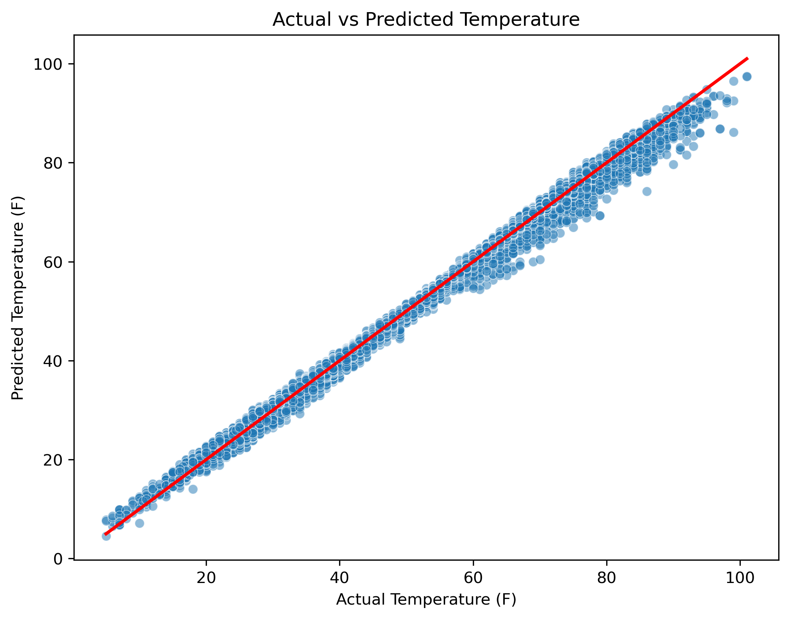
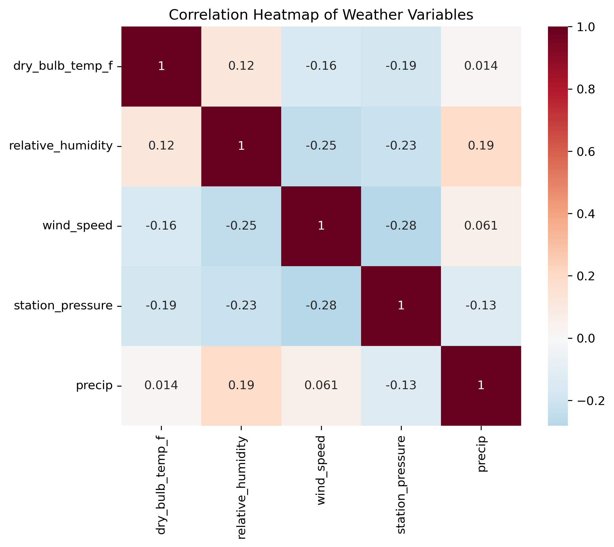
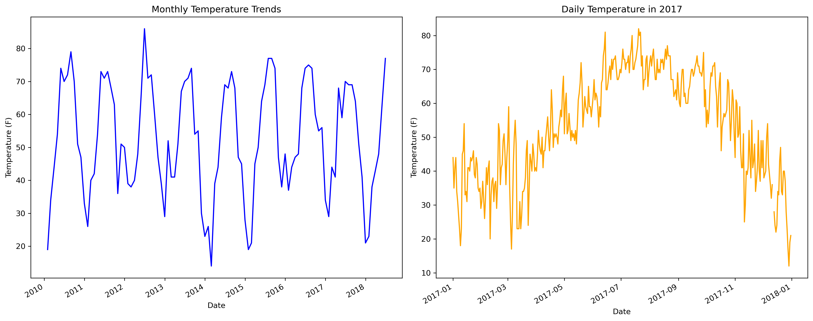

# JFK Weather Data Analysis & Temperature Prediction

### Project Overview
This project analyzes historical weather data from JFK Airport to predict the 'Dry Bulb Temperature'. I practiced data cleaning, visualization, and machine learning during this exercise.

### What I did in this project:
* **Data Cleaning:** Removed special characters (like `*`, `T`) and handled missing values using Pandas.
* **Feature Engineering:** Converted cyclical data like Wind Direction using Sine and Cosine transformations.
* **Data Visualization:** Created a Correlation Heatmap and Temperature Trend charts using Seaborn and Matplotlib.
* **Machine Learning:** Built a **Linear Regression** model to predict temperature based on other weather factors.

### Technologies Used:
* **Python** (Pandas, NumPy, Scikit-learn)
* **Visualization:** Matplotlib, Seaborn
* **Tool:** Jupyter Notebook

### Results:
The model achieved a high accuracy score, showing a strong relationship between humidity, pressure, and temperature.

